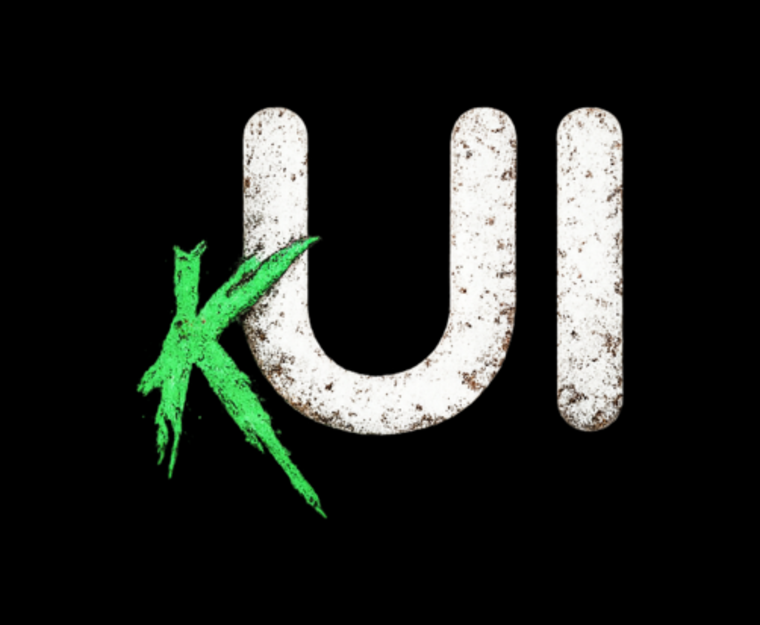

<!-- markdownlint-disable -->
<div align="center">

  

</div>

<hr>

<h4 align="center">
  <a href="https://github.com/ArjunKdaf/kUI/releases">Releases</a>
  ·
  <a href="https://github.com/ArjunKdaf/kUI/releases/latest">Latest</a>
</h4>

<div align="center"><p>
    <a href="https://github.com/ArjunKdaf/kUI/releases/latest">
      
    </a>
    <a href="https://github.com/ArjunKdaf/kUI/blob/main/LICENSE">
      
    </a>
    <a href="https://github.com/ArjunKdaf/kUI/stargazers">
      
    </a>
</div>

---

A custom operating system for the **TrimUI Brick / Hammer**, written from
scratch in **Rust**. No inherited code — one launcher, one libretro game
frontend, one small system daemon, all built for exactly this device.
Faster and lighter than what came before, and fully self-sufficient: kUI
runs the whole show, from the boot chain to the pixels.

## Why kUI

- **Fast.** Boot adds ~1.2 s over the kernel to a fully-dressed carousel;
  navigation, settings, and overlays are instant. 18–24 MB of RAM across
  two processes — the whole OS is a few megabytes on the card.
- **One of everything.** One settings surface (the Control Panel), one
  config file, one LED editor, one save-state universe per game. Nothing
  duplicated, nothing to hunt for.
- **Yours.** Theme colors drive the entire chrome. Artbook carousel. The
  Dude keeps your streaks honest. Your saves, states, art, and history
  are read in place and carried forward.

## Features

**Launcher**
- **Three views** — Carousel (full-art), Covers (list + boxart), or Lists
  (text only), switchable any time.
- **Artbook carousel** with per-system art, tinted to your theme.
- **Pins, Collections, Recents**, per-list cursor memory, and
  launch-origin memory (you return to where you launched from).
- **Game Switcher** — SELECT from anywhere: your recent games as a
  carousel of last-session screenshots.
- **The Dude** — kUI's built-in gamification companion: XP and levels,
  session / daily / weekly quests, achievements, play streaks, and retro
  trivia.
- **Simple Mode** — games only, minimal menus, one toggle.

**Game frontend** (native libretro host)
- **Every core on the card certified** — GB/GBC/GBA, SNES, Genesis / SMS
  / Game Gear, TurboGrafx-16 (+CD) / SuperGrafx, Lynx, NeoGeo Pocket,
  WonderSwan, Virtual Boy, Amiga (+CD32), DOS, and more.
- **8 save-state slots** with PNG previews, plus **auto-resume** into the
  slot you were using.
- **Bezels** (console-shaped / CRT), **five scaling modes**, **screen
  effects** (scanlines, LCD grid), and **GLSL shaders**.
- **Cheats**, **per-game control remapping**, **turbo**, **fast-forward**,
  **multi-disc**, **screenshots**.
- **D-pad-as-stick** for analog titles (the Brick/Hammer has no analog
  sticks) — toggle per game.
- **RetroAchievements** built on the official **rcheevos** library:
  session announce, unlock toasts, badge art, in-game achievement
  browser, plus an offline queue and bulk pre-fetch. Softcore today
  (hardcore pending upstream approval).

**Control Panel** — every setting and tool in one place
- **Appearance** — theme colors (live preview), fonts, backgrounds.
- **Display** — brightness, color temperature, contrast, saturation,
  white point + RGB gains.
- **Connectivity** — real WiFi and Bluetooth pages (scan / connect /
  pair / forget).
- **LED Control** — per-light profiles across every hardware effect,
  including a Gaming profile applied while a game runs.
- **System** — volume, power profile, FN-switch behavior, time zone,
  date & time, developer (SSH), NTP.
- **Tools** — Scraper & Patcher (artwork + metadata), Collections
  manager, Boot Logo picker, Themes, Battery graph, Game tracker, Core
  Options, Input tester, a dual-pane **Files** manager, and **PakDek**
  for installing extra emulators and tools.
- **Updater** — over-the-air updates from the device with a live progress
  bar; no reinstall, no data loss.

**Under the hood**
- **kuid** — a ~1.8 MB system daemon owning battery, LEDs, and radios.
- **kUI-owned boot chain** — the device boots straight into kUI; clean
  shutdown via a direct PMIC sequence.
- **Pak-compatible** — SD layout, env vars, `launch.sh`, and lifecycle
  hooks are honored, so existing paks run. Zero paks shipped, none
  required.

## Supported Systems

| Category | Systems |
|---|---|
| Consoles | Channel F, Atari 2600, Odyssey 2, Intellivision, ColecoVision, Vectrex, SG-1000, NES, Master System, Atari 7800, TurboGrafx-16, SuperGrafx, Genesis, SNES, Neo Geo, GX4000, 3DO, Amiga CD32, Jaguar, Neo Geo CD, Virtual Boy |
| Add-ons | FDS, TurboGrafx-CD, Sega CD, 32X, Jaguar CD |
| Handhelds | Game Boy, Lynx, Game Gear, Supervision, Mega Duck, GBC, NGP/NGPC, WonderSwan/Color, Pokémon Mini, GBA |
| Computers | ZX Spectrum, Atari 800/XL/XE/5200, C64, C128, VIC-20, PET, Plus/4, CPC, MSX, Amiga |
| Other | PICO-8, Uzebox, Doom, Arcade |
| Via PakDek | N64, DreamCast, PSP, DS, Saturn, ScummVM, and more |

## Installing

1. Format the SD card as **FAT32** (MBR)
2. Copy all contents to the SD card root
3. Copy ROMs into the matching `Roms/` folders
4. Copy BIOS files into the matching `Bios/` folders
5. Insert the SD card and power on

Your games, saves, states, box art, collections, and play history stay
exactly where they are — kUI reads them in place.

## Shortcuts

All in-game shortcuts are **rebindable** in Control Panel → Core Options.
Defaults:

<div align="center">

**In-game**

| Shortcut | Action |
|---|---|
| MENU | Pause / in-game menu |
| MENU + R1 | Save state |
| MENU + L1 | Load state |
| MENU + START | Save & quit (into the switcher) |
| MENU + SELECT | Game switcher |
| MENU + B | Reset |
| MENU + X | Screenshot |
| F1 | Turbo (all held buttons) |
| F2 | Fast-forward (toggle) |

**Launcher**

| Shortcut | Action |
|---|---|
| A | Open / launch (auto-resumes your slot) |
| B | Back |
| X | Pin |
| Y, Y | Wipe saves (press twice to confirm) |
| MENU | Quick menu / Control Panel |
| SELECT | Game switcher |
| L1 / R1 | Jump platform |
| L / R | Jump page |
| POWER | Sleep |

</div>

> The Brick/Hammer has **no analog sticks**, so fast-forward lives on the
> **F2** front button (not R3), and Turbo on **F1**.

## Building

Rust stable, cross-compiled to `aarch64-unknown-linux-gnu` with kUI's own
`aarch64-kui-linux-gnu` toolchain (glibc 2.28; place it in `toolchain/`):

```sh
nix-shell --run 'cargo build --release --target aarch64-unknown-linux-gnu'
scripts/package.sh   # assembles the release zip
```

Builds are deterministic.

## Credits

- **kUI** by [ArjunKdaf](https://github.com/ArjunKdaf)
- **Artbook Next** artwork by [Anthony Caccese](https://github.com/anthonycaccese/art-book-next-es)
- **Overlay bezels** by [Shin (KrutzOtrem)](https://github.com/KrutzOtrem/Trimui-Brick-Overlays) (MIT)
- **rcheevos** (RetroAchievements) — MIT, vendored
- **Libretro cores** by their respective authors

## Special Thanks

❤️ [Libretro](https://www.libretro.com/) — none of this would be possible
without the incredible work of the libretro team and the core developers
who keep retro gaming alive. Thank you. ❤️

## License

GPL-3.0 — see [LICENSE](LICENSE). The Dude, the scraper, and the design
are original works by ArjunKdaf; rcheevos is vendored under its MIT
license.
